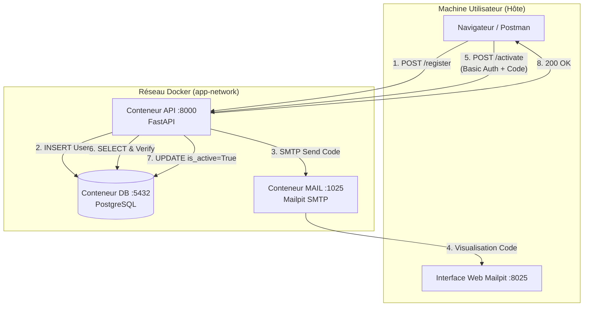
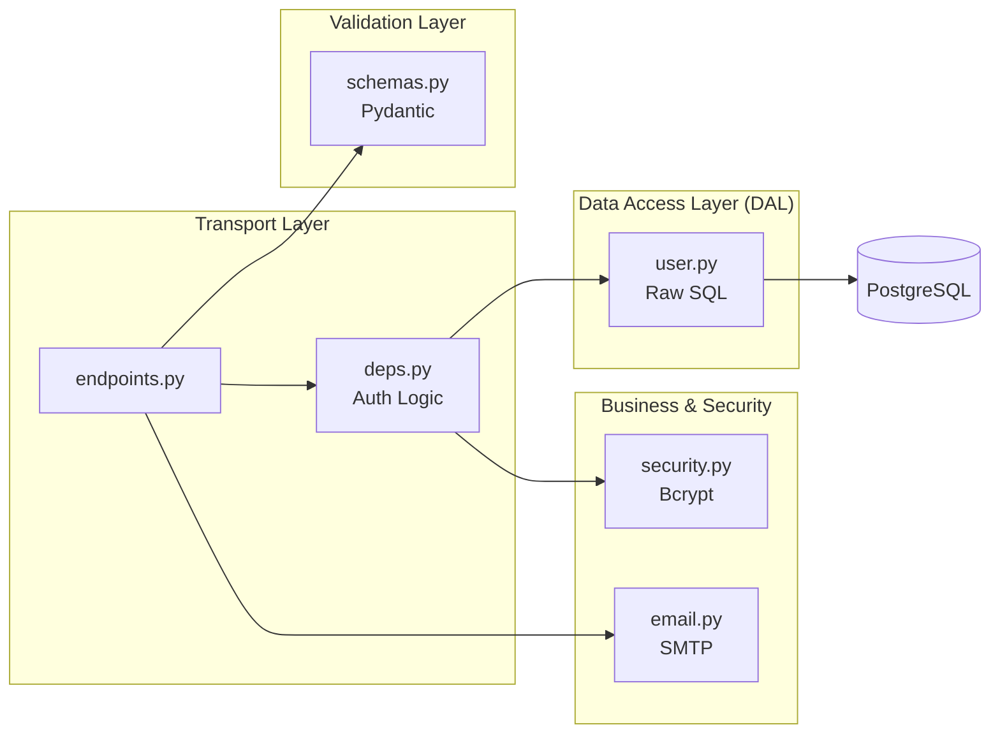

# User Registration & Activation API

Cette API gère l'inscription des utilisateurs et leur activation sécurisée. Elle est conçue avec **FastAPI**, utilise **PostgreSQL** pour le stockage (via SQL pur) et **Mailpit** pour intercepter les emails d'activation.

## 📋 Fonctionnalités
  
*   **Inscription** : Création d'un utilisateur avec email et mot de passe (hashé avec Bcrypt).
*   **Vérification** : Génération d'un code à 4 chiffres envoyé par email.
*   **Activation** : Validation du compte via `BASIC AUTH` et vérification du code.
*   **Expiration** : Le code d'activation expire automatiquement après **60 secondes**.
*   **Architecture DAL** : Accès aux données sans ORM pour un contrôle total du SQL.
*   **Dockerisée** : Environnement complet avec API, Base de données et Serveur Mail.

## 🚀 Installation et Lancement

### 1. Prérequis
*   Docker et Docker Compose installés.

### 2. Démarrage rapide
Pour lancer l'intégralité de la stack (API, PostgreSQL, Mailpit) :
```bash
docker-compose up --build
```


### 3. Accès aux services
*   **API (Documentation Swagger)** : [http://localhost:8000/docs](http://localhost:8000/docs)
*   **Interface Mailpit (Emails reçus)** : [http://localhost:8025](http://localhost:8025)
*   **Base de données** : `localhost:5432` (User: `user`, Password: `password`, DB: `registration_db`)
---

## 🛠 Utilisation de l'API

### Étape 1 : Créer un compte
Envoyez une requête `POST` à `/api/v1/register` avec un email et un mot de passe.
L'API génère un code et simule l'envoi d'un email.

### Étape 2 : Récupérer le code
Ouvrez l'interface **Mailpit**. Vous y verrez l'email contenant le code à 4 chiffres (ex: `7421`).

### Étape 3 : Activer le compte
Envoyez une requête `POST` à `/api/v1/activate` avec le code.
**Attention** : Vous devez fournir vos identifiants via l'authentification **Basic Auth** (Email / Password). L'activation doit être faite dans la minute suivant l'inscription.

---


## 🧪 Tests

Le projet sépare les tests rapides des tests de validation de base de données.

**Exécuter les tests via Docker :**
```bash 
docker-compose run api pytest tests/ -v
```

*   **Tests Unitaires** : Utilisent des mocks pour isoler la logique métier.
*   **Tests d'Intégration** : Utilisent la vraie base de données PostgreSQL pour valider la persistance.

---
## ⚙️ Choix Techniques

*   **FastAPI & Python 3.14** : Utilisation des dernières versions pour bénéficier des performances asynchrones.
*   **Sans ORM** : Utilisation de `Psycopg 3` pour un contrôle total sur les requêtes SQL et des performances optimales.
*   **Sécurité des mots de passe** : Utilisation de `Bcrypt` (via `passlib`). Les mots de passe sont limités à 72 octets pour respecter les contraintes de l'algorithme et éviter les erreurs de troncature.
*   **Mailpit** : Serveur SMTP de développement pour capturer les emails sans configuration complexe de compte réel.
*   **Configuration Dynamique** : L'application détecte automatiquement si elle tourne dans Docker ou en local (`localhost`) via les variables d'environnement.

---

## 🧹 Nettoyage

Pour arrêter les services et supprimer les volumes (données DB) :
```bash 
docker-compose down -v
```

---

## 🏗 Architecture du Projet
Le projet suit une structure modulaire professionnelle pour une meilleure maintenabilité :
```bash
dailymotion/
├── app/                        # Code source de l'application
│   ├── __init__.py
│   ├── main.py                 # Point d'entrée FastAPI & Configuration Lifespan
│   ├── db.py                   # Initialisation DB (DDL) et gestion des connexions
│   │
│   ├── api/                    # Couche Transport (Interface Web)
│   │   ├── __init__.py
│   │   ├── endpoints.py        # Définition des routes (Register, Activate)
│   │   └── deps.py             # Dépendances réutilisables (Authentification Basic)
│   │
│   ├── core/                   # Logique transverse & Configuration
│   │   ├── __init__.py
│   │   ├── config.py           # Gestion des variables d'environnement
│   │   ├── security.py         # Logique de hashing (Bcrypt) et vérification
│   │   └── email.py            # Service d'envoi SMTP (smtplib)
│   │
│   ├── models/                 # Couche d'Accès aux Données (DAL)
│   │   ├── __init__.py
│   │   └── user.py             # Requêtes SQL pures (Select, Insert, Update)
│   │
│   └── schemas/                # Validation & Sérialisation
│       ├── __init__.py
│       └── user.py             # Modèles Pydantic (UserCreate, ActivationRequest)
│
├── tests/                      # Suite de tests
│   ├── __init__.py
│   └── test_endpoints.py       # Tests unitaires des routes avec Mocks
│   └── test_integration.py     # Tests d'intégration (avec vraie base de données)
│
├── docker-compose.yml          # Orchestration (API + PostgreSQL + Mailpit)
├── Dockerfile                  # Image Docker de l'application Python
├── requirements.txt            # Dépendances du projet
├── .gitignore                  # Exclusion des fichiers inutiles (venv, cache, etc.)
└── README.md                   # Documentation du projet
````


### Description des composants :
*   **`app/api/`** : Reçoit les requêtes HTTP, valide l'entrée et délègue au repo. C'est ici que l'authentification `BASIC AUTH` est injectée.
*   **`app/models/`** : Unique endroit où le SQL est écrit. On y utilise `psycopg` pour interagir directement avec PostgreSQL sans passer par un ORM.
*   **`app/core/`** : Contient les "cerveaux" utilitaires comme le hashage des mots de passe et la communication avec le serveur SMTP Mailpit.
*   **`app/db.py`** : Gère la robustesse de la connexion (retry logic) et s'assure que les tables existent au démarrage.

### Architecture Systeme (Docker Compose)
Ce schéma illustre comment les conteneurs communiquent entre eux au sein du réseau Docker (app-network).

### Architecture Logicielle (Interne à l'API)
Voici comment les données circulent à travers les différentes couches du code Python :

### Points clés de l'architecture :
1. **Isolation Réseau** : Tous les services communiquent via le DNS interne de Docker (ex: l'API contacte `db` et non ). `localhost`
2. **DAL (Data Access Layer)** : Le dossier `models/` est le seul point de contact avec le SQL. Si vous changez de base de données, seul ce dossier est impacté.
3. **Validation Découplée** : Les schémas Pydantic (`schemas/`) assurent que les données entrantes sont propres avant même d'atteindre la logique métier.
4. **Mocking facile** : Pour les tests, on remplace simplement la `DAL` par des objets simulés, ce qui permet de tester les `endpoints` sans base de données réelle.
