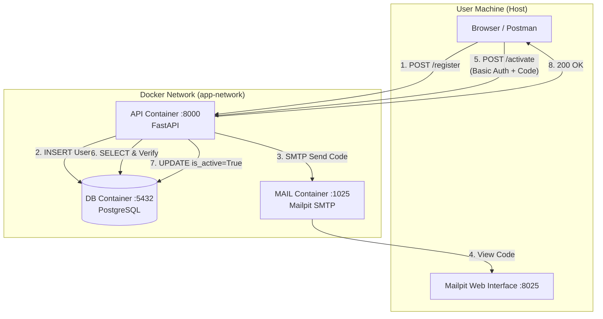
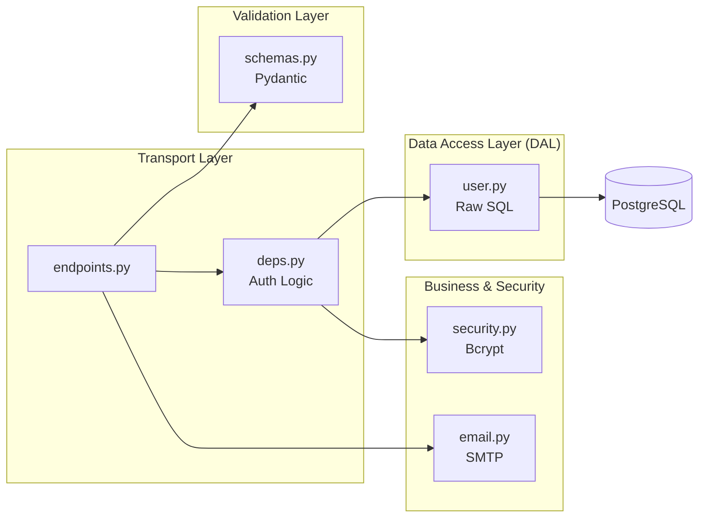

# User Registration & Activation API

A professional, high-performance asynchronous API built with **FastAPI** and **PostgreSQL**. This project manages user registration with email verification and secure account activation.

## 📋 Features
*   **Fully Asynchronous**: Leveraging `aiosmtplib` and `psycopg` (async mode) for non-blocking I/O.
*   **Database Pooling**: Efficient connection management using `psycopg-pool`.
*   **Secure Authentication**: Passwords hashed with **Bcrypt** (pinned to v4.3.0).
*   **Health Monitoring**: Built-in `/health` endpoint monitoring DB and SMTP status.
*   **Production Ready**: Multi-stage `Dockerfile` (slim image) running as a non-root user.
*   **Developer Friendly**: `docker-compose.override.yml` for hot-reloading and dev-tools.

## 🚀 Installation & Startup

### 1. Prerequisites
*   Docker and Docker Compose installed.

### 2. Launching the Stack (Development)
The development mode includes hot-reloading and installs testing tools automatically.
```bash
docker-compose up --build
```

*The `docker-compose.override.yml` is automatically applied, installing dev requirements and mounting your code as a volume.*

### 3. Production Mode (Slim Image & No Dev Tools)
To simulate the production environment strictly (without dev tools or volume mounts):
```bash 
docker-compose -f docker-compose.yml up --build
```

### 3. Service access
*   **API (Swagger documentation)** : http://localhost:8000/docs
*   **Mailpit interface (received emails)** : http://localhost:8025
*   **Health Check**: [http://localhost:8000/api/v1/health](http://localhost:8000/api/v1/health)
*   **Database** : localhost:5432 (User: user, Password: password, DB: registration_db)

⸻

## 🛠 API Usage

### Step 1: Create an account

Send a POST request to /api/v1/register with an email and password.
The API generates a code and simulates sending an email.

### Step 2: Retrieve the code

Open the Mailpit interface. You will see the email containing the 4-digit code (e.g. 7421).

### Step 3: Activate the account

Send a POST request to /api/v1/activate with the code.
Warning: You must provide your credentials via Basic Auth (Email / Password). Activation must be completed within one minute after registration.

---

## 🧪 Testing

The project uses `pytest` and `pytest-asyncio` for testing. 
Ensure the development environment is running to have access to the test tools.

**Run tests inside the running container:**
```bash 
docker-compose exec api pytest tests/ -v
```

*   **Unit Tests** : Use mocks to isolate business logic.
*   **Integration Tests** : Use the real PostgreSQL database to validate persistence.

---

## 🛡 Security & Design

*   **Raw SQL**: No ORM is used. Queries are handwritten in `app/models/user.py` for maximum performance and visibility.
*   **Password Truncation**: Bcrypt inputs are capped at 72 bytes via Pydantic and Security helpers to prevent silent truncation errors.
*   **Non-Root User**: The production container runs under `appuser` to minimize security risks.
*   **Dependency Pinning**: All production and dev requirements are strictly pinned for environment parity.


## ⚙️ Technical Choices
*   **Multi-Stage Dockerfile**: The production image is built in two stages to exclude build tools (`gcc`, `libpq-dev`) and development dependencies, resulting in a smaller and more secure attack surface.
*   **Environment Separation**: 
    *   `requirements.txt`: Core production dependencies.
    *   `requirements-dev.txt`: Development and testing tools.
*   **FastAPI & Python 3.14** : Uses the latest versions to benefit from asynchronous performance.
*   **No ORM** : Uses Psycopg 3 for full control over SQL queries and optimal performance.
*   **Password Security** : Uses Bcrypt (via passlib). Passwords are limited to 72 bytes to comply with the algorithm constraints and avoid truncation issues.
*   **Mailpit** : Development SMTP server to capture emails without complex real-account configuration.
*   **Dynamic Configuration** : The application automatically detects whether it is running in Docker or locally (localhost) via environment variables.

---

## 🧹 Cleanup

To stop services and remove volumes (DB data):
```bash 
docker-compose down -v
```


---

## 🏗 Project Architecture

The project follows a professional modular structure for better maintainability:
```bash
dailymotion/
├── app/                        # Application source code
│   ├── __init__.py
│   ├── main.py                 # FastAPI entry point & Lifespan configuration
│   ├── db.py                   # DB initialization (DDL) and connection management
│   │
│   ├── api/                    # Transport layer (Web interface)
│   │   ├── __init__.py
│   │   ├── endpoints.py        # Route definitions (Register, Activate)
│   │   └── deps.py             # Reusable dependencies (Basic Authentication)
│   │
│   ├── core/                   # Cross-cutting logic & configuration
│   │   ├── __init__.py
│   │   ├── config.py           # Environment variable management
│   │   ├── security.py         # Hashing logic (Bcrypt) and verification
│   │   └── email.py            # SMTP sending service (smtplib)
│   │
│   ├── models/                 # Data Access Layer (DAL)
│   │   ├── __init__.py
│   │   └── user.py             # Raw SQL queries (Select, Insert, Update)
│   │
│   └── schemas/                # Validation & serialization
│       ├── __init__.py
│       └── user.py             # Pydantic models (UserCreate, ActivationRequest)
│
├── tests/                      # Test suite
│   ├── __init__.py
│   └── test_endpoints.py       # Unit tests for routes with mocks
│   └── test_integration.py     # Integration tests (with real database)
│
├── docker-compose.yml          # Orchestration (API + PostgreSQL + Mailpit)
├── docker-compose.override.yml # Local development settings (Hot-reload, dev tools install)
├── Dockerfile                  # Python application Docker image
├── requirements.txt            # Project dependencies
├── requirements-dev.txt        # Development & testing tools (-r requirements.txt included)
├── .gitignore                  # Excluded files (venv, cache, etc.)
└── README.md                   # Project documentation
````

### Component description:
*   **`app/api/`** : Receives HTTP requests, validates input, and delegates to the repository. This is where BASIC AUTH authentication is injected.
*   **`app/models/`** : The only place where SQL is written. Uses psycopg to interact directly with PostgreSQL without an ORM.
*   **`app/core/`** : Contains utility “brains” such as password hashing and communication with the Mailpit SMTP server.
*   **`app/db.py`** : Manages connection robustness (retry logic) and ensures tables exist at startup.

### System Architecture (Docker Compose)

This diagram illustrates how containers communicate with each other within the Docker network (app-network).

### Software Architecture (Internal to the API)

This shows how data flows through the different Python code layers:


### Key architecture points:
1.  **Network Isolation** : All services communicate via Docker’s internal DNS (e.g. the API contacts db and not localhost).
2.	**DAL (Data Access Layer)** : The models/ folder is the only contact point with SQL. If you change databases, only this folder is impacted.
3.	**Decoupled Validation** : Pydantic schemas (schemas/) ensure incoming data is clean before it even reaches business logic.
4.	**Easy Mocking** : For tests, the DAL is simply replaced with mock objects, allowing endpoint testing without a real database.